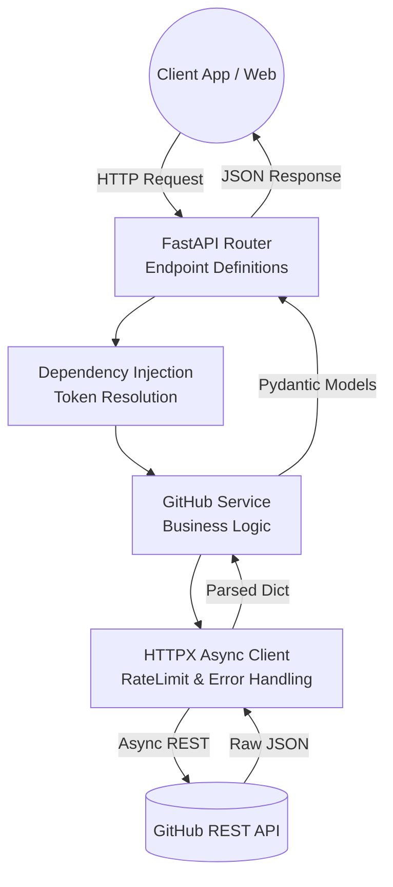

# 🐙 GitHub Cloud Connector

> A professional, production-ready REST API connector for GitHub — built with **FastAPI** and **Python 3.11+**

[](https://python.org)
[](https://fastapi.tiangolo.com)
[](LICENSE)

---

## 📋 Table of Contents

- [Overview](#-overview)
- [Features](#-features)
- [Architecture](#-architecture)
- [Setup Instructions](#-setup-instructions)
- [Running the Project](#-running-the-project)
- [API Endpoints](#-api-endpoints)
- [Authentication](#-authentication)
- [Running Tests](#-running-tests)
- [Project Structure](#-project-structure)

---

## 🚀 Overview

The GitHub Cloud Connector is a clean, structured REST API that wraps the GitHub API and exposes it as an easy-to-consume service. It demonstrates:

- Secure authentication via **Personal Access Token (PAT)** and **OAuth 2.0** 
- Real GitHub API integration across repositories, issues, commits, and pull requests
- Production patterns: middleware, error handling, response shaping, rate limiting

---

## ✨ Features

| Feature | Description |
|---|---|
| 🔐 PAT Authentication | Bearer token via header or environment variable |
| 🔐 OAuth 2.0 *(Bonus)* | Full authorization code flow with CSRF state protection |
| 📦 Repository Management | List (user/org), search, and inspect repositories |
| 🐛 Issue Tracking | List, get, create, and update issues |
| 📝 Commit History | Fetch commits with branch/author/date filters |
| 🔀 Pull Requests *(Bonus)* | List, get, and create pull requests |
| 🛡️ Rate Limiter | Built-in sliding window rate limiting (100 req/60s per IP) |
| 📊 GitHub Rate Limit Tracking | Exposes your remaining GitHub API quota |
| 🔥 Auto Docs | Interactive Swagger UI at `/docs` |

---

## 🏗️ System Architecture Flow



---

## 🏗️ Project Structure

```
github-connector/
├── app/
│   ├── main.py                  # FastAPI app, middleware, routers
│   ├── routes/
│   │   ├── auth.py              # Token validation + OAuth 2.0 routes
│   │   ├── repos.py             # Repository endpoints
│   │   ├── issues.py            # Issue endpoints
│   │   ├── commits.py           # Commit endpoints
│   │   └── pull_requests.py     # Pull request endpoints (bonus)
│   ├── services/
│   │   ├── github_service.py    # Core GitHub API client (all HTTP calls)
│   │   └── auth_service.py      # Auth dependency + OAuth helpers
│   ├── models/
│   │   └── schemas.py           # Pydantic request/response models
│   ├── middleware/
│   │   └── rate_limiter.py      # Sliding window IP rate limiter
│   └── utils/
│       ├── logger.py            # Structured logging
│       └── response_formatter.py # Clean response shaping
├── tests/
│   └── test_connector.py        # Full pytest test suite
├── run.py                       # App entry point
├── requirements.txt
├── .env.example
└── README.md
```

---

## ⚙️ Setup Instructions

### 1. Prerequisites

- Python **3.11+**
- A GitHub account
- A GitHub **Personal Access Token (PAT)**

### 2. Clone the Repository

```bash
git clone https://github.com/your-username/github-connector.git
cd github-connector
```

### 3. Create a Virtual Environment

```bash
python -m venv venv

# Activate (macOS/Linux)
source venv/bin/activate

# Activate (Windows)
venv\Scripts\activate
```

### 4. Install Dependencies

```bash
pip install -r requirements.txt
```

### 5. Configure Environment Variables

```bash
cp .env.example .env
```

Open `.env` and set your GitHub PAT:

```env
GITHUB_TOKEN=ghp_your_personal_access_token_here
```

> **How to create a PAT:**
> 1. Go to [GitHub Settings → Developer Settings → Personal Access Tokens](https://github.com/settings/tokens)
> 2. Click **Generate new token (classic)**
> 3. Select scopes: `repo`, `read:user`, `read:org`
> 4. Copy and paste the token into `.env`

#### Optional: OAuth 2.0 Setup

To enable OAuth 2.0, also set:

```env
GITHUB_CLIENT_ID=your_oauth_app_client_id
GITHUB_CLIENT_SECRET=your_oauth_app_client_secret
GITHUB_REDIRECT_URI=http://localhost:8000/auth/oauth/callback
```

> Create a GitHub OAuth App at: [Settings → Developer Settings → OAuth Apps](https://github.com/settings/applications/new)

---

## ▶️ Running the Project

```bash
python run.py
```

The server starts at **http://localhost:8000**

| URL | Description |
|---|---|
| http://localhost:8000/docs | **Swagger UI** — interactive API explorer |
| http://localhost:8000/redoc | ReDoc documentation |
| http://localhost:8000/health | Health check |

> In development mode, the server auto-reloads on file changes.

---

## 📡 API Endpoints

### Authentication

| Method | Endpoint | Description |
|---|---|---|
| `GET` | `/auth/validate` | Validate token & return user profile |
| `GET` | `/auth/rate-limit` | Check GitHub API rate limit status |
| `GET` | `/auth/oauth/authorize` | Start OAuth 2.0 flow *(bonus)* |
| `GET` | `/auth/oauth/callback` | OAuth 2.0 callback handler *(bonus)* |

### Repositories

| Method | Endpoint | Description |
|---|---|---|
| `GET` | `/repos` | List authenticated user's repositories |
| `GET` | `/repos/user/{username}` | List a specific user's public repos |
| `GET` | `/repos/org/{org}` | List an organization's repositories |
| `GET` | `/repos/search?q={query}` | Search public repositories |
| `GET` | `/repos/{owner}/{repo}` | Get repository details |

### Issues

| Method | Endpoint | Description |
|---|---|---|
| `GET` | `/issues/{owner}/{repo}` | List issues (filter by state/labels) |
| `GET` | `/issues/{owner}/{repo}/{number}` | Get a specific issue |
| `POST` | `/issues/{owner}/{repo}` | Create a new issue |
| `PATCH` | `/issues/{owner}/{repo}/{number}` | Update an issue (title/body/state/labels) |

### Commits

| Method | Endpoint | Description |
|---|---|---|
| `GET` | `/commits/{owner}/{repo}` | List commits (filter by branch/author/date) |
| `GET` | `/commits/{owner}/{repo}/{sha}` | Get a specific commit by SHA |

### Pull Requests *(Bonus)*

| Method | Endpoint | Description |
|---|---|---|
| `GET` | `/pulls/{owner}/{repo}` | List pull requests |
| `GET` | `/pulls/{owner}/{repo}/{number}` | Get a specific pull request |
| `POST` | `/pulls/{owner}/{repo}` | Create a pull request |

---

## 🔐 Authentication

All endpoints require authentication. Pass your GitHub token as a Bearer header:

```bash
Authorization: Bearer ghp_your_token_here
```

### Using curl

```bash
# Validate token
curl -H "Authorization: Bearer ghp_xxx" http://localhost:8000/auth/validate

# List your repos
curl -H "Authorization: Bearer ghp_xxx" http://localhost:8000/repos

# List issues
curl -H "Authorization: Bearer ghp_xxx" http://localhost:8000/issues/octocat/Hello-World

# Create an issue
curl -X POST http://localhost:8000/issues/octocat/Hello-World \
  -H "Authorization: Bearer ghp_xxx" \
  -H "Content-Type: application/json" \
  -d '{"title": "Bug report", "body": "Something is broken.", "labels": ["bug"]}'

# List commits
curl -H "Authorization: Bearer ghp_xxx" \
  "http://localhost:8000/commits/octocat/Hello-World?branch=main&per_page=10"

# Create a pull request
curl -X POST http://localhost:8000/pulls/octocat/Hello-World \
  -H "Authorization: Bearer ghp_xxx" \
  -H "Content-Type: application/json" \
  -d '{"title": "My PR", "head": "feature/branch", "base": "main"}'
```

### Using the Swagger UI

1. Open http://localhost:8000/docs
2. Click **Authorize** (🔒 button, top right)
3. Enter: `Bearer ghp_your_token`
4. All endpoints are now authenticated

---

## 🧪 Running Tests

```bash
pytest tests/ -v
```

Expected output:

```
tests/test_connector.py::test_root                    PASSED
tests/test_connector.py::test_health                  PASSED
tests/test_connector.py::test_validate_token          PASSED
tests/test_connector.py::test_rate_limit              PASSED
tests/test_connector.py::test_no_token_returns_401    PASSED
tests/test_connector.py::test_list_my_repos           PASSED
tests/test_connector.py::test_get_repo                PASSED
tests/test_connector.py::test_list_issues             PASSED
tests/test_connector.py::test_create_issue            PASSED
tests/test_connector.py::test_create_issue_empty_title PASSED
tests/test_connector.py::test_update_issue            PASSED
tests/test_connector.py::test_list_commits            PASSED
tests/test_connector.py::test_list_pull_requests      PASSED
tests/test_connector.py::test_create_pull_request     PASSED
```

All tests use mocking — **no real GitHub API calls are made** during the test suite.

---

## 🛡️ Security Notes

- Tokens are **never hardcoded** — always loaded from environment variables or request headers
- The `.env` file is excluded from version control via `.gitignore`
- OAuth state tokens are one-time-use to prevent CSRF attacks
- A built-in rate limiter protects against abuse (100 requests/60s per IP)

---

## 📦 Tech Stack

| Layer | Technology |
|---|---|
| Language | Python 3.11+ |
| Framework | FastAPI |
| HTTP Client | httpx (async) |
| Validation | Pydantic v2 |
| Server | Uvicorn |
| Testing | pytest |

---

## 📄 License

MIT License — see [LICENSE](LICENSE) for details.
