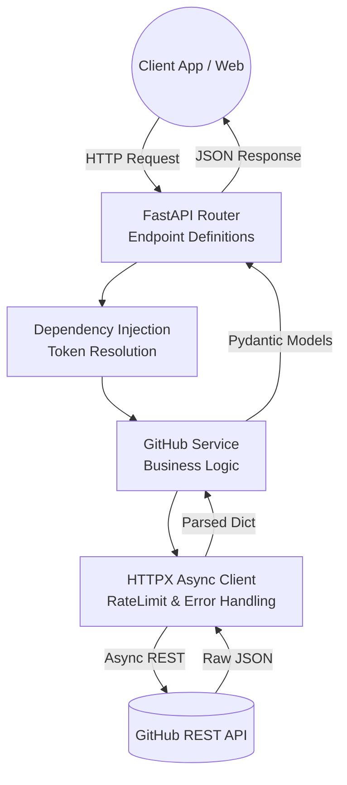

# 🚀 GitHub Cloud Connector

<div align="center">
  <p><strong>A high-performance, asynchronous REST API connector for GitHub built with FastAPI & Python.</strong></p>
  
  
  
</div>

<br />

## 📖 Overview

The **GitHub Cloud Connector** is a production-ready, all-in-one microservice that serves as an intelligent bridge between client applications and the GitHub REST API. Designed with modern architectural patterns, it abstracts away the complexities of direct GitHub integration—handling authentication, asynchronous HTTP requests, rate limiting, and structured data validation.

Whether you're building a dashboard, a developer portal, or an automation tool, this connector provides a clean, documented, and secure interface to interact with GitHub resources.

---

## ✨ Key Features & Architecture

- **Clean Architecture:** Single-file monolithic microservice cleanly separated into Configuration, Models, HTTP Client, Business Logic (Service Layer), and Routes.
- **Asynchronous Operations:** Leverages `httpx` for non-blocking, high-concurrency API calls, ensuring high throughput and low latency.
- **Robust Error Handling:** Custom exception hierarchies map GitHub API errors (e.g., Rate Limits, Auth Failures) into standardized HTTP JSON responses.
- **Dependency Injection:** Utilizes FastAPI's `Depends` to inject the `GitHubService`, allowing for seamless token resolution (from `.env` or request headers) and easier unit testing.
- **Strong Typing & Data Validation:** Fully typed with Pydantic (`v2`) models. It sanitizes and shapes raw GitHub payloads into predictable, strictly typed responses.
- **Interactive OpenAPI Documentation:** Auto-generated interactive Swagger UI out-of-the-box (`/docs`).

---

## 🏗️ System Architecture Flow



---

## 🛠️ Technology Stack

| Component | Technology | Description |
|-----------|-----------|-------------|
| **Framework** | [FastAPI](https://fastapi.tiangolo.com/) | High-performance async web framework |
| **Language** | Python 3.9+ | Backend programming language |
| **Validation** | [Pydantic](https://docs.pydantic.dev/) | Data parsing and schema validation |
| **HTTP Client** | [HTTPX](https://www.python-httpx.org/) | Async HTTP client for external API requests |
| **Server** | [Uvicorn](https://www.uvicorn.org/) | Lightning-fast ASGI server |
| **Config** | `pydantic-settings` | Environment variable management |

---

## 🚀 Getting Started

### 1. Prerequisites
- Python 3.9 or higher installed.
- A GitHub Personal Access Token (Classic). Required scopes: `repo`, `read:user`, `read:org`.

### 2. Installation
Clone the repository and install dependencies:
```bash
# Inside the VS Code terminal
pip install -r requirements.txt
```

### 3. Environment Configuration
Create an environment file:
```bash
# Windows
copy .env.example .env

# macOS / Linux
cp .env.example .env
```
Open `.env` and add your GitHub token:
```env
GITHUB_TOKEN=ghp_your_actual_token_here
```

### 4. Run the Server
Start the Uvicorn ASGI server:
```bash
python main.py
```
> The API will be available at: **http://localhost:8000**
> 
> Interactive Docs (Swagger): **http://localhost:8000/docs**

---

## 📡 API Endpoints Summary

All core endpoints are prefixed with `/api/v1`.

### 🔐 Authentication & Health
| Method | Endpoint | Description |
|--------|---------|-------------|
| `GET`  | `/health` | Application health check status |
| `GET`  | `/api/v1/auth/verify`| Quick token verification |
| `GET`  | `/api/v1/auth/me` | Fetch authenticated user's profile |

### 📁 Repositories
| Method | Endpoint | Description |
|--------|---------|-------------|
| `GET`  | `/api/v1/repos` | List user repositories (supports pagination/sorting) |
| `GET`  | `/api/v1/repos/org/{org}`| List organization repositories |
| `GET`  | `/api/v1/repos/{owner}/{repo}`| Detailed view of a single repository |

### 🐛 Issues
| Method | Endpoint | Description |
|--------|---------|-------------|
| `GET`  | `/api/v1/repos/{owner}/{repo}/issues` | Filterable list of issues |
| `GET`  | `/api/v1/repos/{owner}/{repo}/issues/{id}`| Issue details |
| `POST` | `/api/v1/repos/{owner}/{repo}/issues` | Create a new issue |

### 🌿 Commits & Pull Requests
| Method | Endpoint | Description |
|--------|---------|-------------|
| `GET`  | `/api/v1/repos/{owner}/{repo}/commits` | Commit history (filterable by branch/author) |
| `GET`  | `/api/v1/repos/{owner}/{repo}/pulls` | List active/closed pull requests |
| `POST` | `/api/v1/repos/{owner}/{repo}/pulls` | Create a pull request |

---

## 🧪 Testing with `curl`

Once the server is running, you can test endpoints from standard CLI tools. Keep in mind that for private operations, the token is automatically injected from your `.env` file during execution.

```bash
# Check health
curl http://localhost:8000/health

# Verify identity
curl http://localhost:8000/api/v1/auth/verify

# List 5 open issues for a repository
curl "http://localhost:8000/api/v1/repos/fastapi/fastapi/issues?state=open&per_page=5"
```
